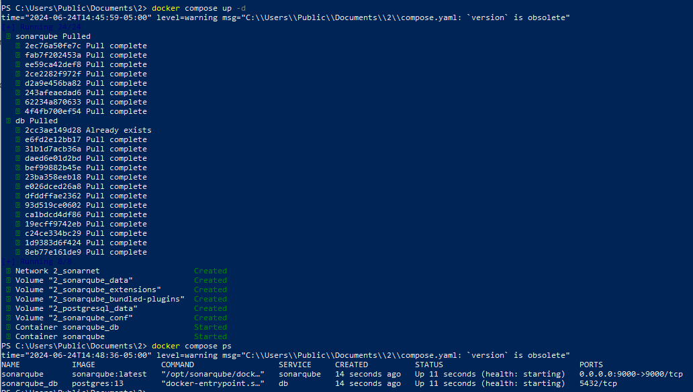

# Ejercicio
Configurar SonarQube utilizando Docker Compose, para esto necesitas dos servicios:
- Servicio: SonarQube
- Desde el host es necesario acceder a SonarQube por lo que necesitas mapear el puerto correspondiente.
- Servicio: PostgreSQL (existen otras opciones: Microsoft SQL Server, Oracle)
- Coloca un healtcheck para cada uno de los servicios.
- Los dos servicios deben pertenecer a uan red de tipo bridge
- Investiga cuáles son los volúmenes necesarios para cada servicio
- Investiga cuáles son las variables de entorno para que los servicios funcionen de manera adecuada.
  

